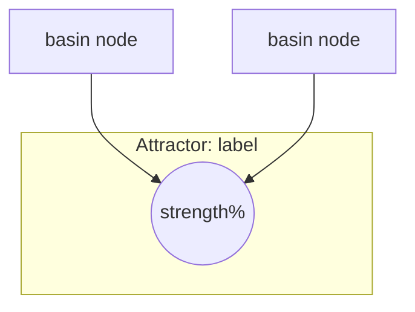
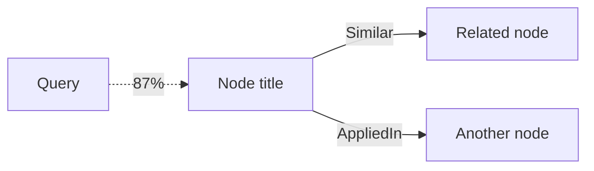

# Memory Map

Render the soul's memory structure visually. Shows attractors (conceptual gravity wells),
their basins, session context, and optionally the neighborhood around a specific query.

**Execute directly** — Produces formatted output for terminal and documentation.

## How to Execute

### Default Mode (attractors + session)

```
# Step 1: Get soul state and attractors
chitta soul_context format="json"
chitta attractors max_attractors=7

# Step 2: Render ASCII summary
=== Soul Memory Map ===

Coherence: XX% [████████░░]  Ojas: XX% [█████████░]
Nodes: XXXX total (XXXX hot, XX warm, XX cold)

ATTRACTORS (X gravity wells)
  [1] first 40 chars of label.........(basin: XX)
  [2] second attractor label..........(basin: XX)
  ...

SESSION
  Primed: XX recent observations
  Active: X intentions
  Basin: XX goal-adjacent nodes

# Step 3: Render Mermaid diagram
```



### Attractors Mode (/memory-map attractors)

Focus on attractor basins with more detail:

```
# Get attractors with higher limit
chitta attractors max_attractors=10

# Render detailed basin view
=== Attractor Basins ===

[1] ATTRACTOR: label (strength: XX%)
    Basin size: XX nodes
    ├─ Node in basin
    ├─ Another node
    └─ Third node

[2] ATTRACTOR: label (strength: XX%)
    ...
```

### Query Mode (/memory-map query <text>)

```
# Step 1: Search with dense zoom to get edges
chitta recall query="<text>", zoom="dense", limit=8

# Step 2: Get soul state for context
chitta soul_context format="json"

# Step 3: Render neighborhood
=== Memory Neighborhood: "<query>" ===

[87%] Node title (wisdom)
      └─Similar→ Related node (0.8)
      └─AppliedIn→ Another node (0.6)
[72%] Second result (episode)
      └─Supports→ Supporting node (0.9)
...

# Step 4: Render Mermaid showing edges
```



### Session Mode (/memory-map session)

```
# Get full session context with ledger
chitta soul_context format="json", include_ledger=true

# Render session state
=== Session Context ===

PRIMING
  Recent observations: XX nodes
  Active intentions: X nodes
  Goal basin: XX nodes

COMPETITION
  Enabled: yes/no
  Threshold: XX%
  Inhibition: XX%

LEDGER (if present)
  Work: X todos
  Next: X steps
  Critical: X items
```

## Output Formats

### ASCII Progress Bars

Build 10-char progress bars from percentage:
- 0-10%:  `[░░░░░░░░░░]`
- 50%:    `[█████░░░░░]`
- 100%:   `[██████████]`

Formula: filled = round(percentage / 10), empty = 10 - filled

### Edge Type Symbols

| Edge Type | ASCII Symbol | Mermaid Arrow |
|-----------|--------------|---------------|
| Similar | `└─Similar→` | `--Similar-->` |
| Supports | `└─Supports→` | `--Supports-->` |
| Contradicts | `└─Contradicts→` | `-.Contradicts.->` |
| AppliedIn | `└─AppliedIn→` | `--AppliedIn-->` |
| EvolvedFrom | `└─EvolvedFrom→` | `--EvolvedFrom-->` |
| PartOf | `└─PartOf→` | `--PartOf-->` |
| TriggeredBy | `└─TriggeredBy→` | `--TriggeredBy-->` |

### Node Type Labels

Show type in parentheses after title:
- `(wisdom)` - Durable knowledge
- `(belief)` - Core convictions
- `(episode)` - Episodic observations
- `(intention)` - Active goals
- `(failure)` - Learned mistakes
- `(dream)` - Aspirational ideas

## When to Use

- **Orientation**: Start of session, understand what's in memory
- **Debugging**: Why did this memory surface? Check edges and relevance
- **Planning**: What attractors exist? Where should new knowledge go?
- **Health check**: Are there orphan nodes? Disconnected clusters?
- **Documentation**: Export Mermaid diagrams for architecture docs
